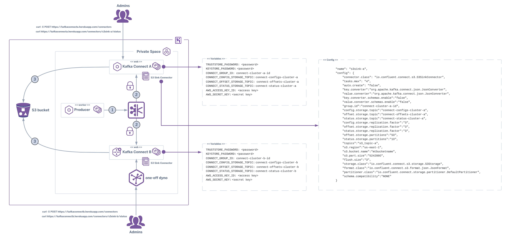

# Kafka Connect with S3 Sink Connector on Heroku
Proof-of-Concept - Running a Kafka Connect cluster with an S3 Sink Connector on a Heroku Private Space. Apps can be configured with or without [internal routing](https://devcenter.heroku.com/articles/internal-routing).

## How it works

Once the Kafka Connect apps are running on Heroku you can start producing data to the topics **(1)** (see [Apache Kafka on Heroku](https://elements.heroku.com/addons/heroku-kafka)) that will be received and managed by the Kafka Connect clusters **(2)** and then stored into the configured S3 bucket **(3)**.<br/>




## Disclaimer
The author of this article makes any warranties about the completeness, reliability and accuracy of this information. **Any action you take upon the information of this website is strictly at your own risk**, and the author will not be liable for any losses and damages in connection with the use of the website and the information provided. **None of the items included in this repository form a part of the Heroku Services.**

## Quick Start

1. Locally, clone and deploy this repository to your Heroku app or click on the Heroku Button

    [](https://heroku.com/deploy)

    ```shell
    git clone https://github.com/abernicchia-heroku/kafka-connect-s3-sink-on-heroku.git
    heroku git:remote --app HEROKU_APPNAME

    heroku config:set TRUSTSTORE_PASSWORD=<your truststore password> -a HEROKU_APPNAME
    heroku config:set KEYSTORE_PASSWORD=<group keystore> -a HEROKU_APPNAME
    heroku config:set CONNECT_GROUP_ID=<group ID e.g. connect-cluster4s3-id> -a HEROKU_APPNAME
    heroku config:set CONNECT_CONFIG_STORAGE_TOPIC=<group ID e.g. connect-configs-cluster4s3> -a HEROKU_APPNAME 
    heroku config:set CONNECT_OFFSET_STORAGE_TOPIC=<group ID e.g. connect-offsets-cluster4s3> -a HEROKU_APPNAME
    heroku config:set CONNECT_STATUS_STORAGE_TOPIC=<group ID e.g. connect-status-cluster4s3> -a HEROKU_APPNAME
    heroku config:set AWS_ACCESS_KEY_ID=<your AWS access key> -a HEROKU_APPNAME
    heroku config:set AWS_SECRET_KEY=<your AWS secret key> -a HEROKU_APPNAME

    heroku apps:stacks:set --app HEROKU_APPNAME container
    git push heroku main
    ```
2. Attach the [Apache Kafka on Heroku add-on](https://elements.heroku.com/addons/heroku-kafka) to your app. By default it will create a KAFKA_URL environment variable, with a KAFKA suffix, but if you have used another name while attaching it to the app (e.g. MYKAFKA), set a KAFKA_ADDON environment with that value as well (e.g. `heroku config:set KAFKA_ADDON=MYKAFKA`)

3. Create an AWS S3 bucket (or use an existing one) - you can use one of the available [Heroku Data Stores add-ons](https://elements.heroku.com/addons#data-stores)

4. Create the topics required by Kafka Connect, for example:
    ```shell
    heroku kafka:topics:create connect-status-cluster4s3 --partitions 3 -a HEROKU_APPNAME
    heroku kafka:topics:create connect-offsets-cluster4s3 --partitions 3 -a HEROKU_APPNAME
    heroku kafka:topics:create connect-configs-cluster4s3 --partitions 1 -a HEROKU_APPNAME
    heroku kafka:topics:create connect-cluster4s3 --partitions 3 -a HEROKU_APPNAME
    ```
5. Create the topics required by the S3 Sink Connector, for example:
    ```shell
    heroku kafka:topics:create connect-configs-s3 --partitions 1 --replication-factor 3 --compaction -a HEROKU_APPNAME
    heroku kafka:topics:create connect-offsets-s3 --partitions 50 --replication-factor 3 -a HEROKU_APPNAME
    heroku kafka:topics:create connect-status-s3 --partitions 10 --replication-factor 3 -a HEROKU_APPNAME
    heroku kafka:topics:create s3_topic --partitions 10 --replication-factor 3 -a HEROKU_APPNAME
    ```

6. Start your web dynos

7. Create the S3 Sink Connector, including some properties, for example:
    ```shell
    curl -X POST https://<your HEROKU APP URL>/connectors -H "Content-Type: application/json" \
    -d '{
            "name": "s3-sink",
            "config": {
                "connector.class": "io.confluent.connect.s3.S3SinkConnector",
                "tasks.max": "4",
                "auto.create": "false",

                "key.converter":"org.apache.kafka.connect.json.JsonConverter",
                "value.converter":"org.apache.kafka.connect.json.JsonConverter",
                "key.converter.schemas.enable":"false",
                "value.converter.schemas.enable":"false",

                "group.id":"mys3connectid",
                "config.storage.topic":"connect-configs-s3",
                "offset.storage.topic":"connect-offsets-s3",
                "status.storage.topic":"connect-status-s3",
                "config.storage.replication.factor":"3",
                "offset.storage.replication.factor":"3",
                "status.storage.replication.factor":"3",
                "offset.storage.partitions":"50",
                "status.storage.partitions":"10",
                "topics":"s3_topic",

                "s3.region":"us-east-1",
                "s3.bucket.name":"bucketeer-a56116d9-1fdb-4359-afe5-f07b12470bd5",
                "s3.part.size":"5242880",
                "flush.size":"3",

                "storage.class":"io.confluent.connect.s3.storage.S3Storage",
                "format.class":"io.confluent.connect.s3.format.json.JsonFormat",
                "partitioner.class":"io.confluent.connect.storage.partitioner.DefaultPartitioner",

                "schema.compatibility":"NONE"
            }
    }'
    ```
8. Create some JSON data, for example:
    ```shell
    kafka-console-producer.sh --bootstrap-server <KAFKA_URL> -topic s3_topic --producer.config client.properties

    > {"fruit":"Apple1","size":"Large1","color":"Red1"}
    > {"fruit":"Apple2","size":"Large2","color":"Red2"}
    > {"fruit":"Apple3","size":"Large3","color":"Red3"}
    ```

9. Check some of the S3 files being created, for example:
    ```shell
    aws configure

    aws s3 ls s3://<bucket name>/topics/s3_topic/
    aws s3 cp s3://<bucket name>/s3_topic/partition=9/s3_topic+9+0000000000.json /tmp/s3_topic+9+0000000000.json  
    ```

10. Monitor the status of your Kafka Connect cluster using the REST API, for example:
    ```shell
    curl https://<your HEROKU APP URL>/connectors/<your CONNECTOR NAME>/status | jq 
    ```
